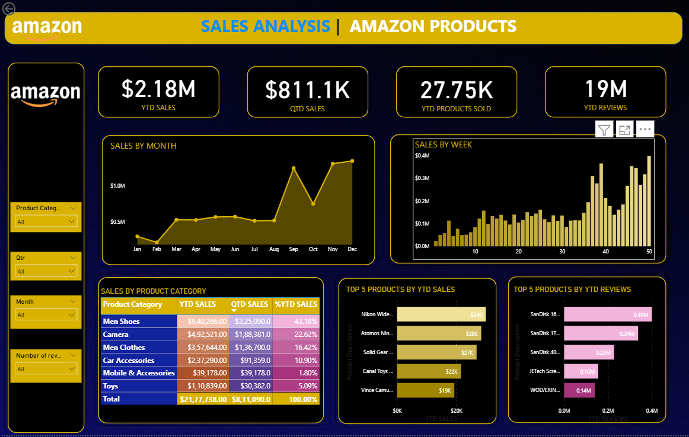

# 📊 Amazon Sales Dashboard

## 🧾 Project Overview
This Power BI project analyzes Amazon sales performance to provide actionable insights into business trends and product performance.  
It focuses on identifying key metrics such as revenue growth, top-selling products, profit margins, and regional performance.

---

## 📈 Dashboard Highlights
- **Sales Overview:** Yearly and quarterly revenue analysis  
- **Top Products:** Best-performing categories and items  
- **Profit Trends:** Visual comparison of profit margins over time  
- **Regional Insights:** State and city-level performance visualization  
- **Interactive Filters:** Slicers for dynamic analysis by date, category, and region  

---

## 🛠️ Tools & Technologies
- **Power BI Desktop (.pbix)** for visualization  
- **Excel / CSV** as data source  
- **DAX (Data Analysis Expressions)** for KPIs and calculated measures  

---

## 🎯 Key Insights
- Identified the top 5 products driving **70% of total revenue**  
- Revealed seasonal trends impacting **quarterly sales growth**  
- Highlighted underperforming categories with potential for improvement  

---

## Dashboard Snapshot

